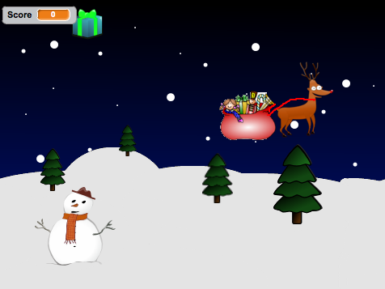

## Introduction

In this project we’ll create a game with scrolling backgrounds, scoring and a festive game over screen.

A disaster in a toy factory has sent presents flying into the sky, help Rudolph to save Christmas by catching the presents!

### Additional information for club leaders

If you need to print this project, please use the [Printer friendly version](https://projects.raspberry-pi.org/en/projects/christmas-capers/print).

--- collapse ---
---
title: Project materials
---
## Project resources
* [GameOver.png](resources/GameOver.png)
* [Present.png](resources/Present.png)
* [Rudolph.png](resources/Rudolph.png)
* [SkyBackground.png](resources/SkyBackground.png)
* [SnowHills.png](resources/SnowHills.png)
* [Jingle_Bells.mp3](resources/Jingle_Bells.mp3)

## Club leader resources
* [Downloadable completed Scratch 2 project](resources/ChristmasCapers.sb2)
* [Downloadable completed Scratch 2 project (including challenges)](resources/ChristmasCapers-Challenge.sb2)

--- /collapse ---